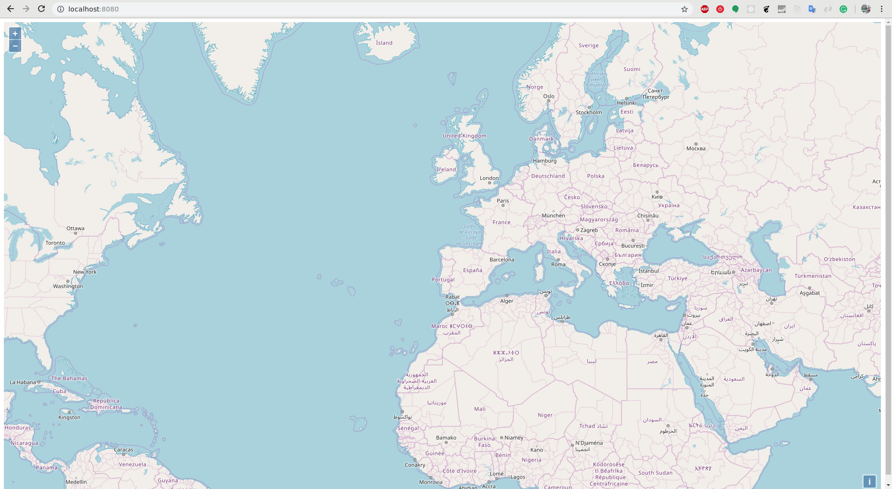

# 1. Creando un mapa.

OpenLayers hace que sea fácil poner un mapa dinámico en cualquier página web. Puede mostrar map tiles, datos vectoriales y marcadores cargados desde cualquier fuente. OpenLayers ha sido desarrollado para promover el uso de información geográfica de todo tipo. Es completamente gratuito, JavaScript de código abierto, publicado bajo la licencia BSD de 2 cláusulas.

Lo primero que necesitaremos para crear nuestro mapa web será crear un nuevo proyecto. Este proyecto será sobre el que iremos trabajando, así que ,!tenedlo ordenado¡.

Crearemos la carpeta `curso-webgis` donde comenzaremos creando nuestro primer visor. Para ello dentro de la carpeta crearemos un archivo `index.html` con el siguiente contenido:

```html
<!doctype html>
<html lang="en">
  <head>
    <title>Mi primer visor con OpenLayers</title>
  </head>
  <body>
  </body>
</html>
```

Acabamos de crear un esqueleto vacío donde iremos creando nuestro pequeño visor. Si arrancamos nuestro servidor web desde dentro de la carpeta

```bash
$ reload

Reload web server:
listening on port 8080
monitoring dir curso-webgis
```

y vamos a nuestro navegador [http://localhost:8080](http://localhost:8080) estaremos viendo nuestra página html vacia.

Lo siguiente que haremos será añadir la librería OpenLayers para poder hacer uso de ella. De momento usaremos un CDN donde se hayan las librerías publicadas. Añadiremos en nuestro HTML lo siguiente

```html hl_lines="4 8"
<!doctype html>
<html lang="en">
  <head>
    <link rel="stylesheet" href="https://cdn.rawgit.com/openlayers/openlayers.github.io/master/en/v5.2.0/css/ol.css" type="text/css">
    <title>Mi primer visor con OpenLayers</title>
  </head>
  <body>
    <script src="https://cdn.rawgit.com/openlayers/openlayers.github.io/master/en/v5.2.0/build/ol.js"></script>
  </body>
</html>
```

Ahora tendremos disponible la librería OpenLayers versión 5.2.0.

De momento no tendremos acceso al mapa. Lo primero que haremos será, mediante código JavaScript iremos creando el mapa. Para ello utilizaremos el objeto [`ol.Map`](http://openlayers.org/en/latest/apidoc/module-ol_Map-Map.html). Es el nucleo de la librería y el encargado de renderizar las vistas y las capas. Será el objeto sobre el que iremos trabajando.

```html hl_lines="9 10 11"
<!doctype html>
<html lang="en">
  <head>
    <link rel="stylesheet" href="https://cdn.rawgit.com/openlayers/openlayers.github.io/master/en/v5.2.0/css/ol.css" type="text/css">
    <title>Mi primer visor con OpenLayers</title>
  </head>
  <body>
    <script src="https://cdn.rawgit.com/openlayers/openlayers.github.io/master/en/v5.2.0/build/ol.js"></script>
    <script type="text/javascript">
      let map = new ol.Map();
    </script>
  </body>
</html>
```

si vamos a nuestro navegador no veremos nada aun. Ahora tenemos un mapa, pero necesitamos engancharlo a nuestro html. Para ello crearemos un punto de enganche mediante un `div` de html y le diremos al mapa que se enganche a él.

```html hl_lines="8 12"
<!doctype html>
<html lang="en">
  <head>
    <link rel="stylesheet" href="https://cdn.rawgit.com/openlayers/openlayers.github.io/master/en/v5.2.0/css/ol.css" type="text/css">
    <title>Mi primer visor con OpenLayers</title>
  </head>
  <body>
    <div id="map" class="map"></div>
    <script src="https://cdn.rawgit.com/openlayers/openlayers.github.io/master/en/v5.2.0/build/ol.js"></script>
    <script type="text/javascript">
      let map = new ol.Map({
        target: 'map'
      });
    </script>
  </body>
</html>
```
!!! warning "Atención"
    El `div` que creemos será referenciado desde el mapa por el `id` que le pongamos, mientras que la clase será necesaria para los estilos CSS.

Ya podremos ver el mapa


*Fig 1. Mapa*

Pero seguimos sin ver mas que unos controles. Si vamos a la documentación de OpenLayers, veremos que el mapa, además del punto de enganche al html necesita un elemento más. 
Según la estructura de OpenLayers, el mapa necesitará de la vista [`view`](http://openlayers.org/en/latest/apidoc/module-ol_View-View.html) que será la encargada de representar el mapa en 2D que estamos creando. Este objeto es el encargado de manejar las propiedades del mapa como `center`, que indica el centro del mapa, `zoom` que indica el zoom al que se está visualizando el mapa y algunas otras propiedades importantes que veremos con mas detalle después.

Crearemos un objeto vista con centro en Vigo y un nivel de zoom dado y se lo pasaremos al mapa:

```html hl_lines="18 19 20"
<!doctype html>
<html lang="en">
  <head>
    <link rel="stylesheet" href="https://cdn.rawgit.com/openlayers/openlayers.github.io/master/en/v5.2.0/css/ol.css" type="text/css">
    <title>Mi primer visor con OpenLayers</title>
    <style>
      html, body, .map  {
        height: 100%
	    }
    </style>
  </head>
  <body>
    <div id="map" class="map"></div>
    <script src="https://cdn.rawgit.com/openlayers/openlayers.github.io/master/en/v5.2.0/build/ol.js"></script>
    <script type="text/javascript">
      let map = new ol.Map({
        target: 'map',
        view: new ol.View({
          center: ol.proj.fromLonLat([-8.72, 42.24]),
          zoom: 4
        })
      });
    </script>
  </body>
</html>
```

Si ahora vamos a [http://localhost:8080](http://localhost:8080), ¡seguimos sin ver nada!. Esto es debido a que nos falta uno de los conceptos más importantes a la hora de trabajar con datos geográficos, la capa. Las capas, `layers` en casi todas las librerías que trabajan con información geográfica, son las encargadas de mostrar los diferentes datos geográficos. Existen muchos tipos de capas que iremos viendo a lo largo del curso. De momento, para visualizar nuestro primer mapa completo, añadiremos una capa base de OpenStreetMap de la siguiente manera:

```html hl_lines="18 19 20 21 22"
<!doctype html>
<html lang="en">
  <head>
    <link rel="stylesheet" href="https://cdn.rawgit.com/openlayers/openlayers.github.io/master/en/v5.2.0/css/ol.css" type="text/css">
    <title>Mi primer visor con OpenLayers</title>
    <style>
      html, body, .map  {
        height: 100%
	    }
    </style>
  </head>
  <body>
    <div id="map" class="map"></div>
    <script src="https://cdn.rawgit.com/openlayers/openlayers.github.io/master/en/v5.2.0/build/ol.js"></script>
    <script type="text/javascript">
      let map = new ol.Map({
        target: 'map',
        layers: [
          new ol.layer.Tile({
            source: new ol.source.OSM()
          })
        ],
        view: new ol.View({
          center: ol.proj.fromLonLat([-8.72, 42.24]),
          zoom: 4
        })
      });
    </script>
  </body>
</html>
```

Si le añaimos un poco de estilo con alguna regla CSS

```html hl_lines="6 7 8 9 10"
<!doctype html>
<html lang="en">
  <head>
    <link rel="stylesheet" href="https://cdn.rawgit.com/openlayers/openlayers.github.io/master/en/v5.2.0/css/ol.css" type="text/css">
    <title>Mi primer visor con OpenLayers</title>
    <style>
      html, body, .map  {
        height: 100%
	    }
    </style>
  </head>
  <body>
    <div id="map" class="map"></div>
    <script src="https://cdn.rawgit.com/openlayers/openlayers.github.io/master/en/v5.2.0/build/ol.js"></script>
    <script type="text/javascript">
      let map = new ol.Map({
        target: 'map',
        layers: [
          new ol.layer.Tile({
            source: new ol.source.OSM()
          })
        ],
        view: new ol.View({
          center: ol.proj.fromLonLat([-8.72, 42.24]),
          zoom: 4
        })
      });
    </script>
  </body>
</html>
```
Tendremos algo así


*Fig 1. primer visor*
