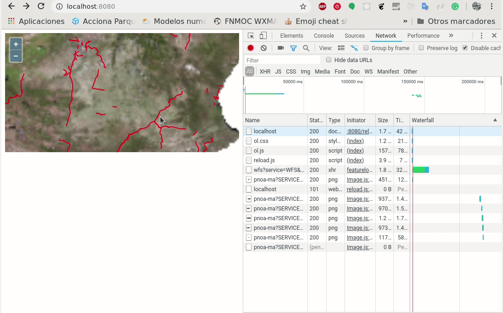

# 5. Interactuando con el mapa

Hasta ahora todo lo que hemos realizado con OpenLayers es la visualización de datos. En este punto de curso, trabajaremos con la interacción del usuario con el mapa a través de los controles que la librería pone a nuestra disposición.

En primer lugar instalaremos algunos de los controles básicos para tener un primer acercamiento al uso de estos dentro de la librería.

## Control de capas

Uno de los primeros controles que necesitaremos dentro de nuestro visor es un Arbol de capas. Este es un control básico en muchos visores, ya que nos permite modificar la visualización de las capas que tenemos configuradas en nuestro visor. Hasta la versión 3 de la librería existía un control de este tipo por defecto, mientras que a partir de esa versión se definió mejor la manera de colaborar con terceras partes, y ahora existen plugins que permiten añadir más funcionalidad a la librería.

Un listado de los plugins que podemos usar con OL la podemos tener directamente en su [web](https://openlayers.org/3rd-party/)

Para nuestro caso, utilizaremos el [`OL-LayerSwitcher`](https://github.com/walkermatt/ol-layerswitcher), que nos aporta un arbol de capas fácilmente configurable.

Crearemos una carpeta `ol-layerswitcher` y dentro nuestra plantilla HTML en un archivo `index.html`

```html
<!DOCTYPE html>
<html>
  <head>
    <title>Control de Capas en OpenLayers</title>
    <link rel="stylesheet" href="https://openlayers.org/en/v5.2.0/css/ol.css" type="text/css">
  </head>
  <body>
     <div id="map" class="map"></div>
    <script src="https://cdn.rawgit.com/openlayers/openlayers.github.io/master/en/v5.2.0/build/ol.js"></script>
    <script>
      const PNOA = new ol.layer.Image({
        source: new ol.source.ImageWMS({
          url: 'http://www.ign.es/wms-inspire/pnoa-ma?',
          params: {'LAYERS': 'OI.OrthoimageCoverage'},
        })
      })
      let map = new ol.Map({
        target: 'map',
        view: new ol.View({
          center: ol.proj.fromLonLat([-8.8120584, 42.2154941]),
          zoom: 11
        }),
      layers: [
        PNOA
      ]
      });
    </script>
  </body>
</html>
```

Primero instalaremos el plugin

```html hl_lines="6 11"
<!DOCTYPE html>
<html>
  <head>
    <title>Control de Capas en OpenLayers</title>
    <link rel="stylesheet" href="https://openlayers.org/en/v5.2.0/css/ol.css" type="text/css">
    <link rel="stylesheet" href="https://unpkg.com/ol-layerswitcher@3.0.0/src/ol-layerswitcher.css" />
  </head>
  <body>
     <div id="map" class="map"></div>
    <script src="https://cdn.rawgit.com/openlayers/openlayers.github.io/master/en/v5.2.0/build/ol.js"></script>
    <script src="https://unpkg.com/ol-layerswitcher@3.0.0"></script>
    <script>
        const PNOA = new ol.layer.Image({
            source: new ol.source.ImageWMS({
            url: 'http://www.ign.es/wms-inspire/pnoa-ma?',
            params: {'LAYERS': 'OI.OrthoimageCoverage'},
            })
        })  
        let map = new ol.Map({
            target: 'map',
            view: new ol.View({
            center: ol.proj.fromLonLat([-8.8120584, 42.2154941]),
            zoom: 11
            }),
        layers: [
            PNOA
        ]
        });
    </script>
  </body>
</html>
```

Seguidamente crearemos las capas necesarias que queramos visualizar

```html hl_lines="19 20 21 22 23 24 25 26 27 28 29 30 31 32 33 34 35 36 37 38 39 40 41 42 43 44 45 46 47 48 49 50 51"
<!DOCTYPE html>
<html>
  <head>
    <title>Control de Capas en OpenLayers</title>
    <link rel="stylesheet" href="https://openlayers.org/en/v5.2.0/css/ol.css" type="text/css">
    <link rel="stylesheet" href="https://unpkg.com/ol-layerswitcher@3.0.0/src/ol-layerswitcher.css" />
  </head>
  <body>
     <div id="map" class="map"></div>
    <script src="https://cdn.rawgit.com/openlayers/openlayers.github.io/master/en/v5.2.0/build/ol.js"></script>
    <script src="https://unpkg.com/ol-layerswitcher@3.0.0"></script>
    <script>
        const PNOA = new ol.layer.Image({
            source: new ol.source.ImageWMS({
            url: 'http://www.ign.es/wms-inspire/pnoa-ma?',
            params: {'LAYERS': 'OI.OrthoimageCoverage'},
            })
        })
        // Nuevas capas
        const watercolor = new ol.layer.Tile({
            source: new ol.source.Stamen({
                layer: 'watercolor'
            })
        })
        const labels = new ol.layer.Tile({
            source: new ol.source.Stamen({
                layer: 'terrain-labels'
            })
        })
        const watercolorHidden = new ol.layer.Tile({
            title: 'Water color',
            type: 'base',
            visible: false,
            source: new ol.source.Stamen({
                layer: 'watercolor'
            })
        })
        const osm = new ol.layer.Tile({
            title: 'OSM',
            type: 'base',
            visible: true,
            source: new ol.source.OSM()
        })
        const carreteras = new ol.layer.Image({
            title: "Carreteras",
            source: new ol.source.ImageWMS({
                url: 'http://www.ign.es/wms-inspire/ign-base?',
                params: {'LAYERS': 'IGNBaseOrto'},
            })
        })
        //       
        let map = new ol.Map({
            target: 'map',
            view: new ol.View({
            center: ol.proj.fromLonLat([-8.8120584, 42.2154941]),
            zoom: 11
            }),
        layers: [
            PNOA
        ]
        });
    </script>
  </body>
</html>
```

Podemos ver que estamos usando un nuevo tipo de fuente `ol.source.Stamen`. [Stamen](http://maps.stamen.com/) es una empresa muy relacionada con el OpenSource ,que también pone a disposición multiples servicios de teselas que pueden ser consumidos desde la librería. 

Seguidamente crearemos la estructura del arbol de capas. Dentro de un arbol de capas principalmente encontraremos las capas que definimos como base, aquellas que queremos que siempre esten visibles, y las capas superpuestas, `overlays` que son aquellas que podremos activar y desactivar cuando deseemos.

Para realizar estos grupos de capas, capas base y superpuestas, utilizaremos un objeto de la librería, el `ol.layer.group` que nos permite agrupar capas. Crearemos un grupo con dos de las capas anteriores para ir conciendo el control

```html hl_lines="30 31 32 33 34 35 36 37 38 39"
<!DOCTYPE html>
<html>
  <head>
    <title>Control de Capas en OpenLayers</title>
    <link rel="stylesheet" href="https://openlayers.org/en/v5.2.0/css/ol.css" type="text/css">
    <link rel="stylesheet" href="https://unpkg.com/ol-layerswitcher@3.0.0/src/ol-layerswitcher.css" />
  </head>
  <body>
     <div id="map" class="map"></div>
    <script src="https://cdn.rawgit.com/openlayers/openlayers.github.io/master/en/v5.2.0/build/ol.js"></script>
    <script src="https://unpkg.com/ol-layerswitcher@3.0.0"></script>
    <script>
        const PNOA = new ol.layer.Image({
            source: new ol.source.ImageWMS({
            url: 'http://www.ign.es/wms-inspire/pnoa-ma?',
            params: {'LAYERS': 'OI.OrthoimageCoverage'},
            })
        })
        // Nuevas capas
        const watercolor = new ol.layer.Tile({
            source: new ol.source.Stamen({
                layer: 'watercolor'
            })
        })
        const labels = new ol.layer.Tile({
            source: new ol.source.Stamen({
                layer: 'terrain-labels'
            })
        })
        const waterWithLabels = new ol.layer.Group({
            title: "Watercolor con etiquetas",
                    type: 'base',
                    combine: true,
                    visible: false,
            layers: [
                watercolor, 
                labels
            ]
        })
        const watercolorHidden = new ol.layer.Tile({
            title: 'Water color',
            type: 'base',
            visible: false,
            source: new ol.source.Stamen({
                layer: 'watercolor'
            })
        })
        const osm = new ol.layer.Tile({
            title: 'OSM',
            type: 'base',
            visible: true,
            source: new ol.source.OSM()
        })
        const carreteras = new ol.layer.Image({
            title: "Carreteras",
            source: new ol.source.ImageWMS({
                url: 'http://www.ign.es/wms-inspire/ign-base?',
                params: {'LAYERS': 'IGNBaseOrto'},
            })
        })
	//
        let map = new ol.Map({
            target: 'map',
            view: new ol.View({
            center: ol.proj.fromLonLat([-8.8120584, 42.2154941]),
            zoom: 11
            }),
        layers: [
            PNOA
        ]
        });
    </script>
  </body>
</html>
```

Ahora en `waterWithLabels` tendremos un grupo de capas formado por dos capas. La propiedad `combine` nos indica que las dos capas serán combinadas y la propiedad `type` nos indicará que son de tipo `baselayer`.

Ahora seguiremos configurando los grupos de capas que manejaremos desde el arbol.

```html hl_lines="56 57 58 59 60 61 62 63 64 65 66 67 68 69 70 71 79 80"
<!DOCTYPE html>
<html>
  <head>
    <title>Control de Capas en OpenLayers</title>
    <link rel="stylesheet" href="https://openlayers.org/en/v5.2.0/css/ol.css" type="text/css">
    <link rel="stylesheet" href="https://unpkg.com/ol-layerswitcher@3.0.0/src/ol-layerswitcher.css" />
  </head>
  <body>
     <div id="map" class="map"></div>
    <script src="https://cdn.rawgit.com/openlayers/openlayers.github.io/master/en/v5.2.0/build/ol.js"></script>
    <script src="https://unpkg.com/ol-layerswitcher@3.0.0"></script>
    <script>
        // Nuevas capas
        const watercolor = new ol.layer.Tile({
            source: new ol.source.Stamen({
                layer: 'watercolor'
            })
        })
        const labels = new ol.layer.Tile({
            source: new ol.source.Stamen({
                layer: 'terrain-labels'
            })
        })
        const waterWithLabels = new ol.layer.Group({
            title: "Watercolor con etiquetas",
                    type: 'base',
                    combine: true,
                    visible: false,
            layers: [
                watercolor, 
                labels
            ]
        })
        const watercolorHidden = new ol.layer.Tile({
            title: 'Water color',
            type: 'base',
            visible: false,
            source: new ol.source.Stamen({
                layer: 'watercolor'
            })
        })
        const osm = new ol.layer.Tile({
            title: 'OSM',
            type: 'base',
            visible: true,
            source: new ol.source.OSM()
        })
        const carreteras = new ol.layer.Image({
            title: "Carreteras",
            source: new ol.source.ImageWMS({
                url: 'http://www.ign.es/wms-inspire/ign-base?',
                params: {'LAYERS': 'IGNBaseOrto'},
            })
        })
        //
        // Grupos del arbol
        const baseLayers = new ol.layer.Group({
            'title': 'Base maps',
            layers: [
                waterWithLabels,
                watercolorHidden,
                osm
            ]
        })
        const overlays = new ol.layer.Group({
                title: 'Overlays',
                layers: [
                    carreteras
                ]
	    })
        //
        let map = new ol.Map({
            target: 'map',
            view: new ol.View({
                center: ol.proj.fromLonLat([-8.8120584, 42.2154941]),
                zoom: 11
            }),
            layers: [
                baseLayers,
                overlays
            ]
        });
    </script>
  </body>
</html>
```

Ahora tendremos las capas configuradas en el control de capas, pero necesitaremos añadir el control al mapa para poder utilizarlo.

```html hl_lines="84 85 86 87"
<!DOCTYPE html>
<html>
  <head>
    <title>Control de Capas en OpenLayers</title>
    <link rel="stylesheet" href="https://openlayers.org/en/v5.2.0/css/ol.css" type="text/css">
    <link rel="stylesheet" href="https://unpkg.com/ol-layerswitcher@3.0.0/src/ol-layerswitcher.css" />
  </head>
  <body>
     <div id="map" class="map"></div>
    <script src="https://cdn.rawgit.com/openlayers/openlayers.github.io/master/en/v5.2.0/build/ol.js"></script>
    <script src="https://unpkg.com/ol-layerswitcher@3.0.0"></script>
    <script>
        // Nuevas capas
        const watercolor = new ol.layer.Tile({
            source: new ol.source.Stamen({
                layer: 'watercolor'
            })
        })
        const labels = new ol.layer.Tile({
            source: new ol.source.Stamen({
                layer: 'terrain-labels'
            })
        })
        const waterWithLabels = new ol.layer.Group({
            title: "Watercolor con etiquetas",
                    type: 'base',
                    combine: true,
                    visible: false,
            layers: [
                watercolor, 
                labels
            ]
        })
        const watercolorHidden = new ol.layer.Tile({
            title: 'Water color',
            type: 'base',
            visible: false,
            source: new ol.source.Stamen({
                layer: 'watercolor'
            })
        })
        const osm = new ol.layer.Tile({
            title: 'OSM',
            type: 'base',
            visible: true,
            source: new ol.source.OSM()
        })
        const carreteras = new ol.layer.Image({
            title: "Carreteras",
            source: new ol.source.ImageWMS({
                url: 'http://www.ign.es/wms-inspire/ign-base?',
                params: {'LAYERS': 'IGNBaseOrto'},
            })
        })
        //
        // Grupos del arbol
        const baseLayers = new ol.layer.Group({
            'title': 'Base maps',
            layers: [
                waterWithLabels,
                watercolorHidden,
                osm
            ]
        })
        const overlays = new ol.layer.Group({
                title: 'Overlays',
                layers: [
                    carreteras
                ]
	    })
        //
        let map = new ol.Map({
            target: 'map',
            view: new ol.View({
                center: ol.proj.fromLonLat([-8.8120584, 42.2154941]),
                zoom: 11
            }),
            layers: [
                baseLayers,
                overlays
            ]
        });

        const layerSwitcher = new ol.control.LayerSwitcher({
            tipLabel: 'Arbol de Capas'
        });
        map.addControl(layerSwitcher);
    </script>
  </body>
</html>
```

## Algunos controles sencillos más

Dentro de la librería disponemos de algunos controles sencillos de instalar. Estos serán por ejemplo el control de vista de pájaro, o el de posición de ratón. A continuación configuraremos ambos.

### Vista de pájaro

Sobre el ejemplo anterior del control de capas, añadiremos el control de Vista de pájaro. Este viene en la librería OpenLayers como `ol.control.OverviewMap`. Para instalar nuevos controles, deberemos insertarlos en una propiedad del mapa denominada `controls`

```html hl_lines="82 83 84"
<!DOCTYPE html>
<html>
  <head>
    <title>Control de Capas en OpenLayers</title>
    <link rel="stylesheet" href="https://openlayers.org/en/v5.2.0/css/ol.css" type="text/css">
    <link rel="stylesheet" href="https://unpkg.com/ol-layerswitcher@3.0.0/src/ol-layerswitcher.css" />
  </head>
  <body>
     <div id="map" class="map"></div>
    <script src="https://cdn.rawgit.com/openlayers/openlayers.github.io/master/en/v5.2.0/build/ol.js"></script>
    <script src="https://unpkg.com/ol-layerswitcher@3.0.0"></script>
    <script>
        // Nuevas capas
        const watercolor = new ol.layer.Tile({
            source: new ol.source.Stamen({
                layer: 'watercolor'
            })
        })
        const labels = new ol.layer.Tile({
            source: new ol.source.Stamen({
                layer: 'terrain-labels'
            })
        })
        const waterWithLabels = new ol.layer.Group({
            title: "Watercolor con etiquetas",
                    type: 'base',
                    combine: true,
                    visible: false,
            layers: [
                watercolor, 
                labels
            ]
        })
        const watercolorHidden = new ol.layer.Tile({
            title: 'Water color',
            type: 'base',
            visible: false,
            source: new ol.source.Stamen({
                layer: 'watercolor'
            })
        })
        const osm = new ol.layer.Tile({
            title: 'OSM',
            type: 'base',
            visible: true,
            source: new ol.source.OSM()
        })
        const carreteras = new ol.layer.Image({
            title: "Carreteras",
            source: new ol.source.ImageWMS({
                url: 'http://www.ign.es/wms-inspire/ign-base?',
                params: {'LAYERS': 'IGNBaseOrto'},
            })
        })
        //
        // Grupos del arbol
        const baseLayers = new ol.layer.Group({
            'title': 'Base maps',
            layers: [
                waterWithLabels,
                watercolorHidden,
                osm
            ]
        })
        const overlays = new ol.layer.Group({
                title: 'Overlays',
                layers: [
                    carreteras
                ]
	    })
        //
        let map = new ol.Map({
            target: 'map',
            view: new ol.View({
                center: ol.proj.fromLonLat([-8.8120584, 42.2154941]),
                zoom: 11
            }),
            layers: [
                baseLayers,
                overlays
            ],
            controls: ol.control.defaults().extend([
                new ol.control.OverviewMap()
            ])
        });

        const layerSwitcher = new ol.control.LayerSwitcher({
            tipLabel: 'Arbol de Capas'
        });
        map.addControl(layerSwitcher);
    </script>
  </body>
</html>
```

### Posición del ratón

El control de posición del ratón nos permite obtener las coordenadas de la posición del ratón. Como el control anterior, se trata de un control que viene con la librería, en el objeto `ol.control.MousePosition`.

Para instalar el control, necesitaremos un sitio donde visualizar las coordenadas, así que lo primero crearemos esto.

```html hl_lines="10"
<!DOCTYPE html>
<html>
  <head>
    <title>Control de Capas en OpenLayers</title>
    <link rel="stylesheet" href="https://openlayers.org/en/v5.2.0/css/ol.css" type="text/css">
    <link rel="stylesheet" href="https://unpkg.com/ol-layerswitcher@3.0.0/src/ol-layerswitcher.css" />
  </head>
  <body>
    <div id="map" class="map"></div>
    <div id="mouse-position"></div>
    <script src="https://cdn.rawgit.com/openlayers/openlayers.github.io/master/en/v5.2.0/build/ol.js"></script>
    <script src="https://unpkg.com/ol-layerswitcher@3.0.0"></script>
    <script>
        // Nuevas capas
        const watercolor = new ol.layer.Tile({
            source: new ol.source.Stamen({
                layer: 'watercolor'
            })
        })
        const labels = new ol.layer.Tile({
            source: new ol.source.Stamen({
                layer: 'terrain-labels'
            })
        })
        const waterWithLabels = new ol.layer.Group({
            title: "Watercolor con etiquetas",
                    type: 'base',
                    combine: true,
                    visible: false,
            layers: [
                watercolor, 
                labels
            ]
        })
        const watercolorHidden = new ol.layer.Tile({
            title: 'Water color',
            type: 'base',
            visible: false,
            source: new ol.source.Stamen({
                layer: 'watercolor'
            })
        })
        const osm = new ol.layer.Tile({
            title: 'OSM',
            type: 'base',
            visible: true,
            source: new ol.source.OSM()
        })
        const carreteras = new ol.layer.Image({
            title: "Carreteras",
            source: new ol.source.ImageWMS({
                url: 'http://www.ign.es/wms-inspire/ign-base?',
                params: {'LAYERS': 'IGNBaseOrto'},
            })
        })
        //
        // Grupos del arbol
        const baseLayers = new ol.layer.Group({
            'title': 'Base maps',
            layers: [
                waterWithLabels,
                watercolorHidden,
                osm
            ]
        })
        const overlays = new ol.layer.Group({
                title: 'Overlays',
                layers: [
                    carreteras
                ]
	    })
        //
        let map = new ol.Map({
            target: 'map',
            view: new ol.View({
                center: ol.proj.fromLonLat([-8.8120584, 42.2154941]),
                zoom: 11
            }),
            layers: [
                baseLayers,
                overlays
            ],
            controls: ol.control.defaults().extend([
                new ol.control.OverviewMap()
            ])
        });

        const layerSwitcher = new ol.control.LayerSwitcher({
            tipLabel: 'Arbol de Capas'
        });
        map.addControl(layerSwitcher);
    </script>
  </body>
</html>
```

Después configuraremos el control y lo añadiremos al mapa

```html hl_lines="73 74 75 76 77 78 79 80 81 94"
<!DOCTYPE html>
<html>
  <head>
    <title>Control de Capas en OpenLayers</title>
    <link rel="stylesheet" href="https://openlayers.org/en/v5.2.0/css/ol.css" type="text/css">
    <link rel="stylesheet" href="https://unpkg.com/ol-layerswitcher@3.0.0/src/ol-layerswitcher.css" />
  </head>
  <body>
    <div id="map" class="map"></div>
    <div id="mouse-position"></div>
    <script src="https://cdn.rawgit.com/openlayers/openlayers.github.io/master/en/v5.2.0/build/ol.js"></script>
    <script src="https://unpkg.com/ol-layerswitcher@3.0.0"></script>
    <script>
        // Nuevas capas
        const watercolor = new ol.layer.Tile({
            source: new ol.source.Stamen({
                layer: 'watercolor'
            })
        })
        const labels = new ol.layer.Tile({
            source: new ol.source.Stamen({
                layer: 'terrain-labels'
            })
        })
        const waterWithLabels = new ol.layer.Group({
            title: "Watercolor con etiquetas",
                    type: 'base',
                    combine: true,
                    visible: false,
            layers: [
                watercolor, 
                labels
            ]
        })
        const watercolorHidden = new ol.layer.Tile({
            title: 'Water color',
            type: 'base',
            visible: false,
            source: new ol.source.Stamen({
                layer: 'watercolor'
            })
        })
        const osm = new ol.layer.Tile({
            title: 'OSM',
            type: 'base',
            visible: true,
            source: new ol.source.OSM()
        })
        const carreteras = new ol.layer.Image({
            title: "Carreteras",
            source: new ol.source.ImageWMS({
                url: 'http://www.ign.es/wms-inspire/ign-base?',
                params: {'LAYERS': 'IGNBaseOrto'},
            })
        })
        //
        // Grupos del arbol
        const baseLayers = new ol.layer.Group({
            'title': 'Base maps',
            layers: [
                waterWithLabels,
                watercolorHidden,
                osm
            ]
        })
        const overlays = new ol.layer.Group({
                title: 'Overlays',
                layers: [
                    carreteras
                ]
	    })
        //
        // Control MousePosition
        const mousePositionControl = new ol.control.MousePosition({
            coordinateFormat: ol.coordinate.createStringXY(4),
            projection: 'EPSG:4326',
            className: 'custom-mouse-position',
            target: document.getElementById('mouse-position'),
            undefinedHTML: '&nbsp;'
        });
        //
        let map = new ol.Map({
            target: 'map',
            view: new ol.View({
                center: ol.proj.fromLonLat([-8.8120584, 42.2154941]),
                zoom: 11
            }),
            layers: [
                baseLayers,
                overlays
            ],
            controls: ol.control.defaults().extend([
                new ol.control.OverviewMap(),
                mousePositionControl
            ])
        });

        const layerSwitcher = new ol.control.LayerSwitcher({
            tipLabel: 'Arbol de Capas'
        });
        map.addControl(layerSwitcher);
    </script>
  </body>
</html>
```

## Interactuando con el servidor
Como ya hemos comentado, la mayoría de los servicios que estamos visualizando se encuentran en servidores desde los que nosotros consumimos sus datos a través de los diferentes servicios definidos para ello. Uno de los servicios con los que podemos interactuar será el servicio WMS. Este servicio nos permite realizar consultas sobre un punto determinado del mapa. Este tipo de consultas vienen definidas en el estandar como [`GetFeatureInfo`](http://docs.geoserver.org/stable/en/user/services/wms/reference.html#getfeatureinfo). 

Esta consulta es una de las más utilizadas para obtener información desde los servidores, y dentro de las librerías de mapas ya existen implementaciones de la petición que nos permiten configurar consultas desde el mapa.

Para empezar, crearemos una carpeta `ol-getfeatureinfo` con nuestro `index.html`.

```html
<!DOCTYPE html>
<html>
  <head>
    <title>Interactuando con el servidor con OpenLayers</title>
    <link rel="stylesheet" href="https://openlayers.org/en/v5.2.0/css/ol.css" type="text/css">
  </head>
  <body>
     <div id="map" class="map"></div>
    <script src="https://cdn.rawgit.com/openlayers/openlayers.github.io/master/en/v5.2.0/build/ol.js"></script>
    <script>
        const toner = new ol.layer.Tile({
            source: new ol.source.Stamen({
                layer: 'toner'
            })
        })
        const map = new ol.Map({
            target: 'map',
            view: new ol.View({
                center: ol.proj.fromLonLat([-8.8120584, 42.2154941]),
                zoom: 12
            }),
            layers: [
                toner
            ]
        });
    </script>
  </body>
</html>
```

Ahora configuraremos una capa WMS sobre la que haremos las consultas, por ejemplo la capa de [rios](http://wms.mapama.es/sig/Agua/RedHidrograficaMDT/wms.aspx?service=wms&version=1.3.0&request=GetCapabilities) del Ministerio de Medio Ambiente. Si recordamos de los ejercicios anteriores, necesitaremos la URL base del servicio `http://wms.mapama.es/sig/Agua/RedHidrograficaMDT/wms.aspx?` y el nombre de la capa que obteníamos del archivo de capabilities.

```XML hl_lines="1 2"
<Layer queryable="1">
<Name>HY.PhysicalWaters.Waterbodies</Name>
<Title>Red hidrográfica básica MDT 100x100</Title>
<Abstract>
Servicio Web de Mapas conforme al perfil INSPIRE de ISO19128-WMS 1.3.0 que permite acceder a conjunto de datos de la Red hidrográfica generada a partir del MDT de celda 100 x 100 (CEDEX). Generado por la Subdirección General de Infraestructuras y Tecnología (Ministerio de Agricultura y Pesca, Alimentación y Medio Ambiente).
</Abstract>
<KeywordList>
<Keyword>HY.PhysicalWaters.Waterbodies</Keyword>
</KeywordList>
<BoundingBox CRS="CRS:84" minx="-22.729594" miny="25.912170" maxx="5.836872" maxy="45.945160"/>
<BoundingBox CRS="EPSG:4230" minx="26.275447" miny="-18.409876" maxx="44.85536" maxy="5.22598"/>
<BoundingBox CRS="EPSG:4326" minx="26.275447" miny="-18.409876" maxx="44.85536" maxy="5.22598"/>
<BoundingBox CRS="EPSG:4258" minx="26.275447" miny="-18.409876" maxx="44.85536" maxy="5.22598"/>
<BoundingBox CRS="EPSG:32627" minx="770000" miny="3000000" maxx="2700000" maxy="5000000"/>
<BoundingBox CRS="EPSG:32628" minx="180000" miny="3000000" maxx="2170000" maxy="5000000"/>
<BoundingBox CRS="EPSG:23029" minx="-410000" miny="3000000" maxx="1650000" maxy="5000000"/>
<BoundingBox CRS="EPSG:23030" minx="-1050000" miny="3000000" maxx="1150000" maxy="5000000"/>
<BoundingBox CRS="EPSG:23031" minx="-1615000" miny="3000000" maxx="620000" maxy="5000000"/>
<BoundingBox CRS="EPSG:32629" minx="-410000" miny="3000000" maxx="1650000" maxy="5000000"/>
<BoundingBox CRS="EPSG:32630" minx="-1050000" miny="3000000" maxx="1150000" maxy="5000000"/>
<BoundingBox CRS="EPSG:32631" minx="-1615000" miny="3000000" maxx="620000" maxy="5000000"/>
<BoundingBox CRS="EPSG:25829" minx="-410000" miny="3000000" maxx="1650000" maxy="5000000"/>
<BoundingBox CRS="EPSG:25830" minx="-1050000" miny="3000000" maxx="1150000" maxy="5000000"/>
<BoundingBox CRS="EPSG:25831" minx="-1615000" miny="3000000" maxx="620000" maxy="5000000"/>
<BoundingBox CRS="EPSG:3857" minx="-2100000" miny="3000000" maxx="500000" maxy="5600000"/>
<Attribution>
<Title>
Ministerio de Agricultura y Pesca, Alimentación y Medio Ambiente (MAPAMA)
</Title>
<OnlineResource xlink:type="simple" xlink:href="https://www.mapama.gob.es"/>
</Attribution>
<Identifier authority="MAPAMA">ESMAGRAMADGARIOS0007</Identifier>
<MetadataURL type="ISO19139:2005">
<Format>text/xml</Format>
<OnlineResource xmlns:xlink="http://www.w3.org/1999/xlink" xlink:type="simple" xlink:href="https://www.mapama.gob.es/ide/metadatos/srv/spa/csw?SERVICE=CSW&VERSION=2.0.2&REQUEST=GetRecordById&outputSchema=http://www.isotc211.org/2005/gmd&ElementSetName=full&ID=8bcffce8-9c9c-4d1e-9a3e-b83e175bbd27"/>
</MetadataURL>
<Style>
<Name>default</Name>
<Title>
Estilo Ministerio Red hidrográfica básica MDT 100x100
</Title>
<Abstract>
Estilo de representación MAPAMA de Red hidrográfica básica MDT 100x100
</Abstract>
<LegendURL width="268" height="32">
<Format>image/png</Format>
<OnlineResource xmlns:xlink="http://www.w3.org/1999/xlink" xlink:href="http://wms.mapama.gob.es/sig/Agua/RedHidrograficaMDT/Leyenda/RedHidrograficaBasica.png" xlink:type="simple"/>
</LegendURL>
</Style>
<Style>
<Name>HY.PhysicalWaters.Waterbodies.Default.Polyline</Name>
<Title>Water bodies default style</Title>
<Abstract>
Estilo de representación INSPIRE: Physical waters as watercourses or standing water can be portrayed with different geometries depending on its dimensions and the level of detail or resolution. Lineal watercourses are depicted by solid blue (#33CCFF) lines with stroke width of 1 pixel and the superficial ones are depicted by filled blue light polygons (#CCFFFF) without border. Punctual standing waters are depicted by dark blue (#0066FF) circles with size of 6 pixel and the superficial ones are depicted by filled blue light polygons (#CCFFFF) without border.
</Abstract>
<LegendURL>
<Format>image/png</Format>
<OnlineResource xmlns:xlink="http://www.w3.org/1999/xlink" xlink:href="http://wms.mapama.gob.es/sig/Agua/RedHidrograficaMDT/wms.aspx?VERSION=1.1.0&REQUEST=GetLegendGraphic&LAYER=HY.PhysicalWaters.Waterbodies&STYLE=HY.PhysicalWaters.Waterbodies.Default.Polyline&FORMAT=image/png" xlink:type="simple"/>
</LegendURL>
<StyleSheetURL>
<Format>text/xml</Format>
<OnlineResource xmlns:xlink="http://www.w3.org/1999/xlink" xlink:href="http://wms.mapama.gob.es/sig/Agua/RedHidrograficaMDT/wms.aspx?request=GetStyles&layers=HY.PhysicalWaters.Waterbodies&version=1.3.0" xlink:type="simple"/>
</StyleSheetURL>
</Style>
</Layer>
```
Otro parámetro importante a tener en cuenta es el valor de `queryable` que aparece en la capa. Un valor 1 (`true`) significa que la capa es consultable mientras que un valor 0 (`false`) indica que no lo es.

Configuraremos la capa

```html hl_lines="16 17 18 19 20 21 22 23 24 25 26 27 33"
<!DOCTYPE html>
<html>
  <head>
    <title>Interactuando con el servidor con OpenLayers</title>
    <link rel="stylesheet" href="https://openlayers.org/en/v5.2.0/css/ol.css" type="text/css">
  </head>
  <body>
     <div id="map" class="map"></div>
    <script src="https://cdn.rawgit.com/openlayers/openlayers.github.io/master/en/v5.2.0/build/ol.js"></script>
    <script>
        const toner = new ol.layer.Tile({
            source: new ol.source.Stamen({
                layer: 'toner'
            })
        })
        const source = new ol.source.ImageWMS({
          url: 'http://wms.mapama.es/sig/Agua/RedHidrograficaMDT/wms.aspx?',
          params: {'LAYERS': 'HY.PhysicalWaters.Waterbodies'}
        })
        const rios = new ol.layer.Image({
            source
        })
        const view = new ol.View({
            center: [-8.8120584, 42.2154941],
            zoom: 12,
            projection: 'EPSG:4326'
            })
        const map = new ol.Map({
            target: 'map',
            view ,
            layers: [
                toner,
                rios
            ]
        });
    </script>
  </body>
</html>
```

Ahora configuraremos el control que nos permite hacer las consultas. Lo que haremos será obtener una url que nos permitirá consultar al servicio los datos de donde estemos pinchando.

```html hl_lines="9 38 39 40 41 42 43 44 45 46 47"
<!DOCTYPE html>
<html>
  <head>
    <title>Interactuando con el servidor con OpenLayers</title>
    <link rel="stylesheet" href="https://openlayers.org/en/v5.2.0/css/ol.css" type="text/css">
  </head>
  <body>
    <div id="map" class="map"></div>
    <div id="info" style="width: 100%"></div>
    <script src="https://cdn.rawgit.com/openlayers/openlayers.github.io/master/en/v5.2.0/build/ol.js"></script>
    <script>
        const toner = new ol.layer.Tile({
            source: new ol.source.Stamen({
                layer: 'toner'
            })
        })
        const source = new ol.source.ImageWMS({
          url: 'http://wms.mapama.es/sig/Agua/RedHidrograficaMDT/wms.aspx?',
          params: {'LAYERS': 'HY.PhysicalWaters.Waterbodies'}
        })
        const rios = new ol.layer.Image({
            source
        })
        const view = new ol.View({
            center: [-8.8120584, 42.2154941],
            zoom: 12,
            projection: 'EPSG:4326'
            })
        const map = new ol.Map({
            target: 'map',
            view ,
            layers: [
                toner,
                rios
            ]
        });

        map.on('singleclick', function(evt) {
            const viewResolution = view.getResolution();
            const url = source.getGetFeatureInfoUrl(
            evt.coordinate, viewResolution, 'EPSG:4326',
            {'INFO_FORMAT': 'text/html'});
            if (url) {
         	document.getElementById('info').innerHTML =
              	'<iframe seamless src="' + url + '" style="width: 100%; height: 300px"></iframe>';
            }
        });
    </script>
  </body>
</html>
```

Lo primero a tener en cuenta es `map.on()`. Lo que hacemos aquí es engancharle una función al [evento `singleclick`](http://openlayers.org/en/latest/apidoc/module-ol_MapBrowserEvent-MapBrowserEvent.html#event:singleclick) del mapa. De esta manera, cuando pinchemos sobre el mapa, se lanzará este evento con un parámetro `evt` donde tendremos las coordenadas del punto donde hemos pinchado en el mapa. Existen variedad de eventos en el mapa sobre los que podemos interacctuar simplemente conectándonos a ellos de la misma manera

```javascript
map.on('tipo_de_evento', callback)
```

La fuente de tipo `ol.source.ImageWMS` tiene un método que nos permite construir una url donde podremos consultar el dato que necesitamos. Los parámetros que necesita el método se consiguen desde la vista y el evento. Un parámetro importante a tener en cuenta es el `INFO_FORMAT`. Como en otros protocolos, deberemos ver en las [capacidades](http://wms.mapama.es/sig/Agua/RedHidrograficaMDT/wms.aspx?service=wms&version=1.3.0&request=GetCapabilities) del servicio, los formatos de respuesta que tenemos disponibles. Con este parámetro le indicamos en que formato queremos que nos devuelva los datos.

```XML hl_lines="2 3 4 5"
<GetFeatureInfo>
    <Format>application/vnd.ogc.wms_xml</Format>
    <Format>text/xml</Format>
    <Format>text/html</Format>
    <Format>text/plain</Format>
    <DCPType>
        <HTTP>
            <Get>
                <OnlineResource xmlns:xlink="http://www.w3.org/1999/xlink" xlink:type="simple" xlink:href="http://wms.mapama.gob.es/sig/Agua/RedHidrograficaMDT/wms.aspx?"/>
            </Get>
        </HTTP>
    </DCPType>
</GetFeatureInfo>
```

!!! tip
    Si disponemos del formato de salida en `application/json` obtendremos los datos en `geojson` lo que nos permitiría representarlos en el mapa como vimos en ejemplos anteriores.

## Interactuando en el cliente

Siguiendo en la linea de interaccionar con los datos, en el ejemplo anterior vimos como obtener datos de un servidor. Como ya hemos comentado en otras secciones del curso, hay casos en los que el volumen de datos nos permite descargar estos en el cliente mediante una petición. Por ejemplo usando el servicio *WFS* del que ya hemos hablado. 

Creamos de nuevo una carpeta `ol-dataclient` y creamos nuestro archivo `index.html`

```html
<!DOCTYPE html>
<html>
  <head>
    <title>Interactuando en el cliente</title>
    <link rel="stylesheet" href="https://openlayers.org/en/v5.2.0/css/ol.css" type="text/css">
  </head>
  <body>
     <div id="map" class="map"></div>
    <script src="https://cdn.rawgit.com/openlayers/openlayers.github.io/master/en/v5.2.0/build/ol.js"></script>
    <script>
      const PNOA = new ol.layer.Image({
        source: new ol.source.ImageWMS({
          url: 'http://www.ign.es/wms-inspire/pnoa-ma?',
          params: {'LAYERS': 'OI.OrthoimageCoverage'},
        })
      })
      const vectorSource = new ol.source.Vector({
        format: new ol.format.GeoJSON(),
        url: function(extent) {
          return 'https://cors-anywhere.herokuapp.com/http://ideadif.adif.es/gservices/Tramificacion/wfs?service=WFS&version=1.1.0&' + 
		    'request=GetFeature&typename=Tramificacion:TramosFueraServicio&outputFormat=application/json&srsname=EPSG:3857&';
        },
        strategy: ol.loadingstrategy.all
      });
      const tramos = new ol.layer.Vector({
        source: vectorSource,
        style: new ol.style.Style({
          stroke: new ol.style.Stroke({
            color: 'red',
            width: 2
          })
        })
      });
      let map = new ol.Map({
        target: 'map',
        view: new ol.View({
          center: ol.proj.fromLonLat([-3.6832130, 40.2589448]),
          zoom: 6
        }),
      layers: [
        PNOA,
	    tramos
      ]
      });
    </script>
  </body>
</html>
```

Lo que tendremos es el resultado del ejercicio del WFS que utilizaremos como base para explorar las consultas en el cliente. Tras la carga de del servicio WFS (revisar la pestaña *Network* ya que esta consulta puede tardar bastante dependiendo de la velocidad de la red) tendremos todas las geometrías descargadas en nuestro cliente. Si abrimos la pestaña *Network* y movemos el mapa, veremos que ya no se hacen peticiones al servicio WFS (`wfs?service=WFS&...`) ya que disponemos de todos los datos en el cliente.



Ahora la interacción desde el cliente con los datos del cliente será inmediata. Deberemos usar los objetos `ol.interaction.Select` que nos permitirán añadir esa interacción al mapa. 

```html hl_lines="9 10 11 14 15 16 17 18 19 20 21 22 23 24 25 26 27 28 29 30 31 32 33 34 35 71 72 73 74 75 76 77 78 79 80 81"
<!DOCTYPE html>
<html>
  <head>
    <title>Interactuando en el cliente</title>
    <link rel="stylesheet" href="https://openlayers.org/en/v5.2.0/css/ol.css" type="text/css">
  </head>
  <body>
    <div id="map" class="map"></div>
    <div id="div-data-features">
	    <table id="data-features"></table>
    </div>
    <script src="https://cdn.rawgit.com/openlayers/openlayers.github.io/master/en/v5.2.0/build/ol.js"></script>
    <script>
        // Utilidad para crear una tabla
        const createTableFromFeature = feature => {
            const div = document.getElementById('div-data-features');
            let table = document.getElementById('data-features');
            if (table) {
                div.removeChild(table)
                table = document.createElement('table');
                table.id = 'data-features';
                div.appendChild(table);
            }
            const properties = feature.getProperties()
            Object.keys(properties).forEach(key => {
                if (properties[key]) {
                    const row = table.insertRow(0);
                    const cell1 = row.insertCell(0);
                    const cell2 = row.insertCell(1);
                    cell1.innerHTML = key;
                    cell2.innerHTML = properties[key];
                }
            })
        }
        //
        const PNOA = new ol.layer.Image({
            source: new ol.source.ImageWMS({
            url: 'http://www.ign.es/wms-inspire/pnoa-ma?',
            params: {'LAYERS': 'OI.OrthoimageCoverage'},
            })
        })
        const vectorSource = new ol.source.Vector({
            format: new ol.format.GeoJSON(),
            url: function(extent) {
            return 'https://cors-anywhere.herokuapp.com/http://ideadif.adif.es/gservices/Tramificacion/wfs?service=WFS&version=1.1.0&' + 
                'request=GetFeature&typename=Tramificacion:TramosFueraServicio&outputFormat=application/json&srsname=EPSG:3857&';
            },
            strategy: ol.loadingstrategy.all
        });
        const tramos = new ol.layer.Vector({
            source: vectorSource,
            style: new ol.style.Style({
            stroke: new ol.style.Stroke({
                color: 'red',
                width: 2
            })
            })
        });
        let map = new ol.Map({
            target: 'map',
            view: new ol.View({
            center: ol.proj.fromLonLat([-3.6832130, 40.2589448]),
            zoom: 6
            }),
            layers: [
                PNOA,
                tramos
            ]
        });

      	// Añadimos interacción
        const selectSingleClick = new ol.interaction.Select({
            hitTolerance: 5
        });
        map.addInteraction(selectSingleClick);
            selectSingleClick.on('select', (e) => {
                e.selected.forEach(feature => {
                    createTableFromFeature(feature);
                })
        });
	    //
    </script>
  </body>
</html>
```

En la parte de la interacción es donde conectamos el evento del `singleclick` con el mapa. De esta manera, pulsando sobre el mismo, nos devolverá los elementos sobre los que hayamos pulsado a la vez que los selecciona. Al contrario que en el ejemplo anterior, no se está realizando ninguna consulta a un servidor externo una vez que se han descargado todos los datos. Y las interacciones se realizan dentro del cliente.

[Probar con Leaflet](./../leaflet/5_interactuando_mapa)